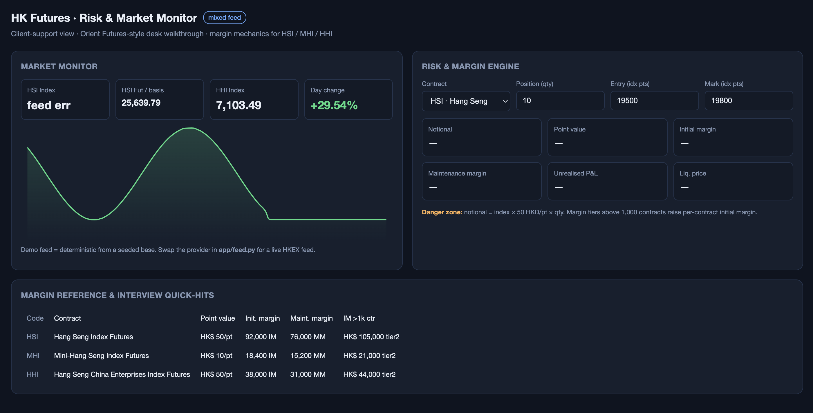

# HK Futures · Risk & Market Monitor

A quick look of demo dashboard is presented below:




## Quick start (local)

```bash
python3 -m venv venv
./venv/bin/pip install -r requirements.txt
./venv/bin/uvicorn app.main:app --port 8031
# open http://localhost:8031
```

Run the risk-engine tests:
```bash
./venv/bin/python test_risk.py   # -> "risk engine: ALL ASSERTIONS PASS"
```

## Architecture

- [`app/feed.py`](app/feed.py) — **graceful-fallback feed layer**. Tries a live
  provider, falls back to a deterministic demo feed, and labels the UI with
  `live` / `mixed` / `demo`. **This is the production-correct pattern for a
  support tool: the dashboard never goes blank because a third-party feed
  hiccuped.** Swap in a licensed HKEX feed by replacing `_try_live()`; the
  consumers don't change.
- [`app/risk.py`](app/risk.py) — pure margin/risk math, unit-tested. No I/O.
- [`app/config.py`](app/config.py) — contract specs + margin. **Values are
  indicative**; validate against the live HKEX "Daily Margin Rates" page.
- [`app/main.py`](app/main.py) — FastAPI. Three endpoints: `/api/market`,
  `/api/contracts`, `/api/risk`.
